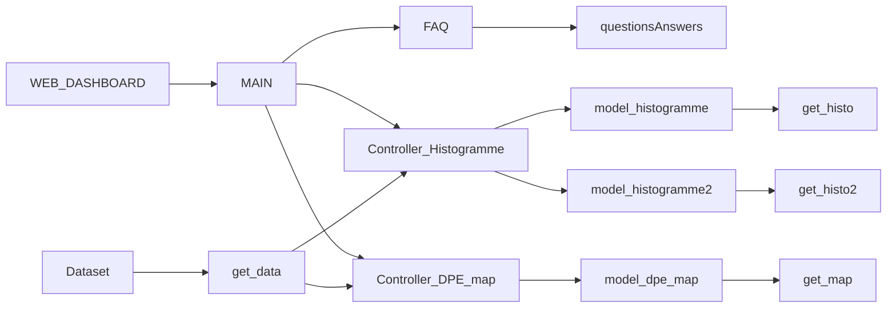

## Architecture du code

```mermaid
flowchart LR;
  WEB_DASHBOARD-->MAIN;
  MAIN & get_data-->Controller_Histogramme & Controller_DPE_map;
  MAIN-->FAQ-->questionsAnswers;
  Dataset-->get_data;
  Controller_Histogramme-->model_histogramme & model_histogramme2;
  model_histogramme-->get_histo;
  model_histogramme2-->get_histo2;
  Controller_DPE_map-->model_dpe_map;
  model_dpe_map-->get_map;
```