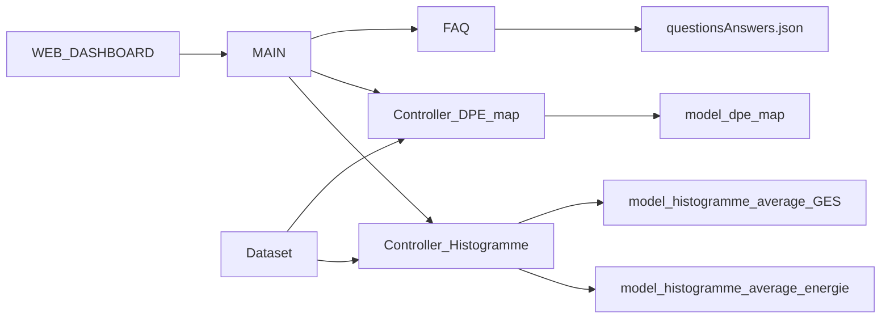
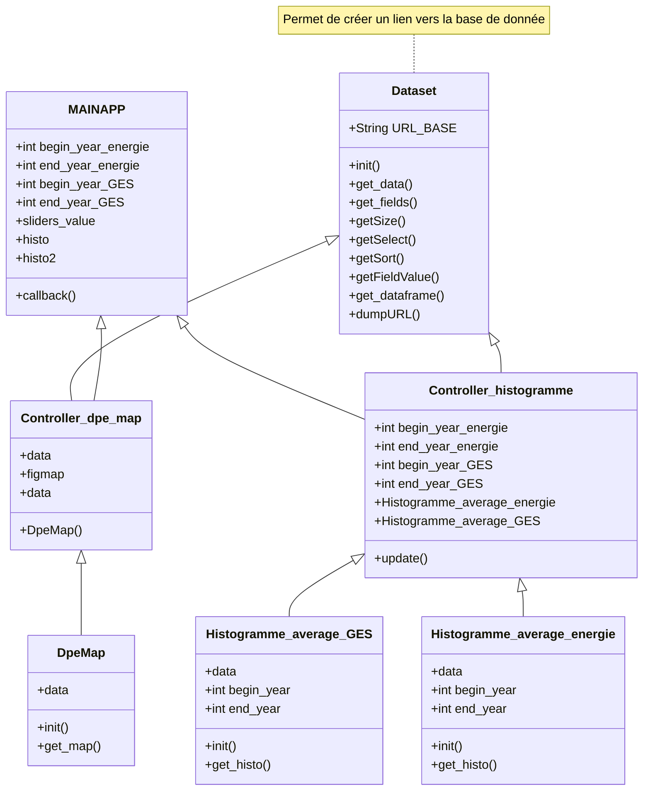

# User guide
## Présentation du projet
Ce projet porte sur les Diagnostics de Performance Energétique (DPE) en France. Il est composé de deux histogrammes et d'une carte de la France.\
Un histogramme montre les émissions de Gaz à effet de Serre en fonction de l'année de construction des foyers. Puis le deuxième montre la consommation énergétique en fonction de l'année de construction des foyers.\
Pour la carte de la France il y a des points de différentes couleurs (couleurs qui décrit la classe consommation d'énergie du foyer).

Les données sont disponibles sur le site https://www.data.gouv.fr/fr/datasets/dpe-logements-avant-juillet-2021/ .

## Installation
Pour installer le projet sur votre machine personnelle, en vous plaçant dans la zone de travail que vous voulez, il vous suffit de taper l'instruction : \
`$ git clone https://github.com/DOMESDAY7/dashboard_dpe. git`

Ce projet utilise des packages dont voici la liste : 
+ colorama version 0.4.6
+ dash version 2.7.0
+ pandas version 1.5.0
+ plotly version 5.10.0
+ requests version 2.28.1

Après l'installation du projet sur votre machine, pour que le projet fonctionne, il vous faut installer les packages additionnels qui se trouvent dans le requirements.txt. Pour ce faire il vous faut utiliser l'instruction suivante : \
`$ python -m pip install -r requirements.txt`

## Démarrage
En vous plaçant dans le projet, c'est-à-dire ./dashboard_dpe dans le cas où vous n'avez pas changé le nom du projet sur votre machine, vous pouvez lancer le programme en utilisant l'instruction : \
`$ python main.py`

Ensuite il vous suffit d'aller à l'adresse indiquée dans un navigateur, dans notre cas il s'agit de http://127.0.0.1:8050/.

## Utilisation
Sur cette page web, vous pouvez visionner deux histogrammes, une carte de la France, ainsi qu'une FAQ qui répond aux questions potentielles de l'utilisateur. 

Pour chaque histogramme, vous avez un slider qui permet de définir l'intervalle d'année. A partir de ces deux paramètres(année de début et année de fin), les histogrammes sont mis à jour automatiquement. 

Pour la carte de France, en plaçant votre curseur sur la carte vous pouvez zoomer/ dézoomer avec la molette. Vous pouvez aussi cliquer sur les classes de consommation d'énergie que vous voulez voir ou non.

## Architecture du code
Dans notre architecture, nous nous sommes inspirés de l'architecture MVC (Model View Controller).
### Synthèse des fichiers

### Avec les interactions

## Copyright
Je déclare sur l’honneur que le code fourni a été produit par moi/nous même, à l’exception des lignes ci dessous.

Pour chaque ligne (ou groupe de lignes) empruntée, donner la référence de la source et une explication de la syntaxe utilisée.

Toute ligne non déclarée est réputée être produite par l’auteur (ou les auteurs) du projet. L’absence ou l’omission de déclaration sera considéré comme du plagiat.
