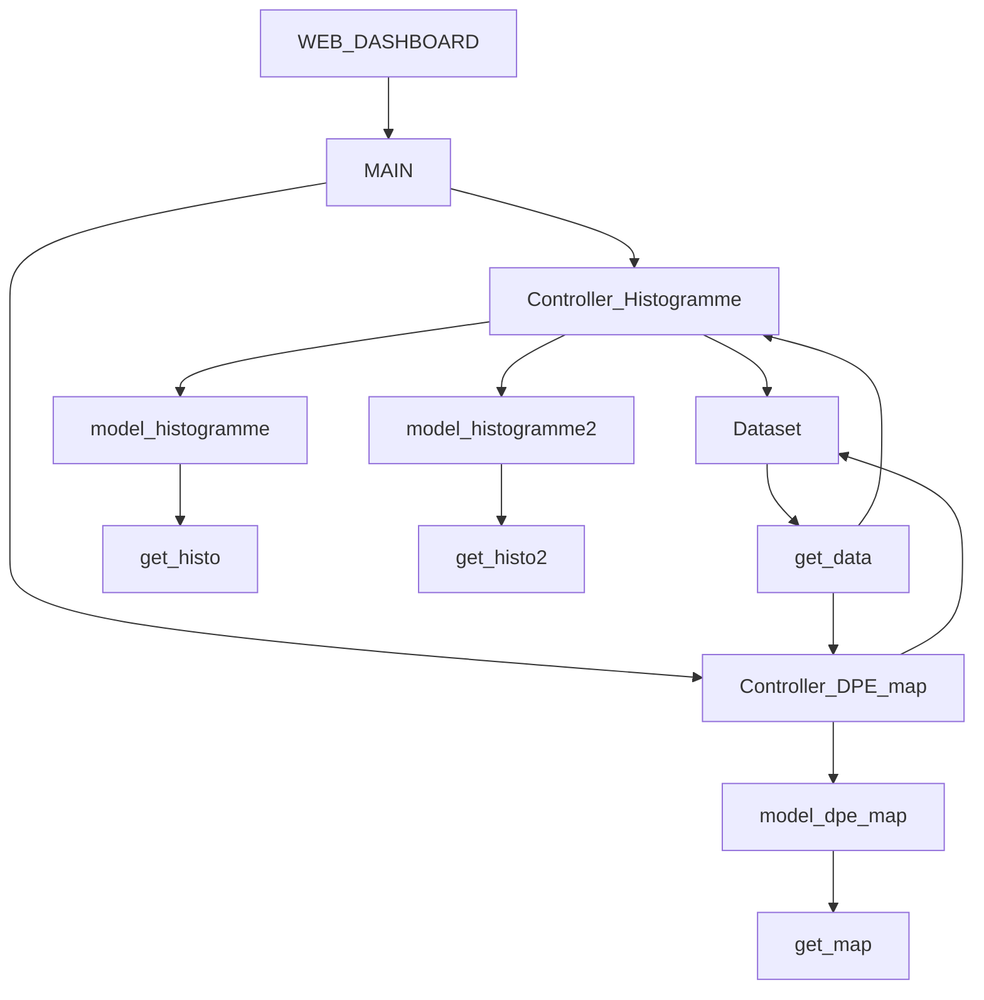

```mermaid
graph TD;
  WEB_DASHBOARD-->MAIN;
  MAIN-->Controller_Histogramme;
  MAIN-->Controller_DPE_map;
  Controller_Histogramme-->model_histogramme;
  Controller_Histogramme-->model_histogramme2;
  Controller_Histogramme-->Dataset-->get_data-->Controller_Histogramme;
  model_histogramme-->get_histo;
  model_histogramme2-->get_histo2;
  Controller_DPE_map-->model_dpe_map;
  Controller_DPE_map-->Dataset;
  get_data-->Controller_DPE_map;
  model_dpe_map-->get_map;
```